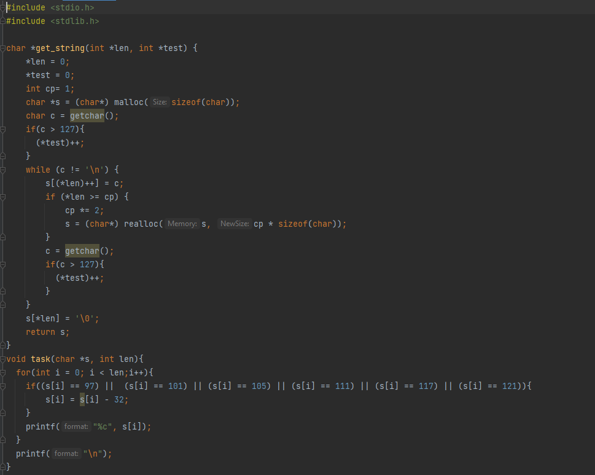
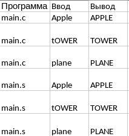

# Домашнее задание номер 2 по АВС
## Вариант 5, Ермолаев Глеб Олегович, БПИ216
 Задание:
 ```
 Разработать программу, заменяющую все строчные гласные буквы
в заданной ASCII-строке заглавными
```
# На 5 баллов




Результаты тестирования программы



По результатам тестирования делаем однозначный вывод, что программы работают эквивалентно и правильно.

Команды для проверки:
```
gcc main.s
gcc ./a.out
```

Описание функций:
```
char *get_string(int *len, int *test) - в параметрах два указателя. первый - len, на переменную,
в которой будет лежать длина строки, второй - test на переменную, которая отображает, корректен ли ввод.

void task(char *s, int len) - в параметрах указатель на строку, 
в которой надо изменить строчные буквы на заглавные, а также длина этой строки.
```

